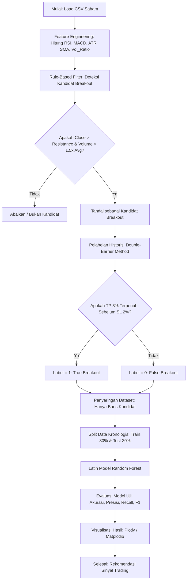

# LAPORAN PENELITIAN & METODOLOGI
## PROYEK SISTEM CERDAS: DETEKSI DAN PREDIKSI POLA BREAKOUT PADA PASAR SAHAM MENGGUNAKAN PENDEKATAN HYBRID (RULE-BASED & MACHINE LEARNING)

**Tim Peneliti (Kelompok Breakout 1):**
1. **Edisyah Putra Waruwu**
2. **Marviel David**
3. **Andri Simbolon**

---

### A. Algoritma dan Flow Eksekusi (Step-by-Step)

Pendekatan hybrid yang dirancang dalam program ini menggabungkan kekuatan sistem berbasis aturan (**Rule-Based System**) dan pembelajaran mesin (**Machine Learning**). Sistem berbasis aturan digunakan sebagai penyaring awal untuk menyortir kandidat breakout dari ribuan baris data transaksi harian, sedangkan model Machine Learning berperan sebagai pengambil keputusan tingkat lanjut untuk memprediksi apakah kandidat tersebut merupakan breakout asli (*True Breakout*) atau jebakan pasar (*False Breakout/Bull Trap*).

Berikut adalah alur eksekusi program secara terstruktur:



#### Deskripsi Alur Eksekusi:

1. **Load Data CSV:**
   Program memuat dataset historis saham dengan kolom standar (`Date`, `Open`, `High`, `Low`, `Close`, `Volume`). Tanggal diformat menjadi indeks waktu (*Datetime Index*) dan data diurutkan secara menaik (*ascending*).
2. **Feature Engineering (Technical Indicators):**
   Program menghitung indikator teknikal dari data dasar. Indikator ini mencakup RSI, MACD, rasio SMA harga, rasio volume, volatilitas, dan ATR ternormalisasi. Indikator ini nantinya akan digunakan sebagai fitur input bagi model Machine Learning.
3. **Deteksi Kandidat (Rule-Based):**
   Program menentukan tingkat resistensi menggunakan harga tertinggi dalam jangka waktu tertentu (misalnya 20 hari). Ketika harga penutupan (*Close*) hari ini memecahkan resistensi kemarin dan volume transaksi melonjak secara signifikan di atas rata-ratanya, hari tersebut ditandai sebagai **Kandidat Breakout** (`Is_Candidate = True`).
4. **Pelabelan Data (Double-Barrier Method):**
   Untuk setiap kandidat breakout, program melihat ke depan (*forward-looking*) hingga $H$ hari (misalnya 5 hari). Jika harga menyentuh target keuntungan (*Take Profit* / TP) sebesar 3% sebelum menyentuh batas kerugian (*Stop Loss* / SL) sebesar 2%, maka transaksi dilabeli sebagai **True Breakout (1)**. Sebaliknya, jika SL tertembus duluan atau TP tidak tercapai, dilabeli **False Breakout (0)**.
5. **Penyaringan & Pemisahan Data (Train/Test Split):**
   Model Machine Learning hanya dilatih menggunakan baris data yang terdeteksi sebagai kandidat breakout. Pemisahan data dilakukan secara **kronologis (Time-Series Split)** dengan proporsi 80% data awal sebagai data latih (*training*) dan 20% data akhir sebagai data uji (*testing*). Pemisahan acak biasa dihindari demi mencegah kebocoran data (*data leakage/look-ahead bias*).
6. **Pelatihan Model Machine Learning:**
   Algoritma **Random Forest Classifier** dilatih menggunakan fitur-fitur teknikal yang telah disiapkan. Parameter `class_weight='balanced'` diterapkan untuk menangani ketidakseimbangan kelas (*class imbalance*).
7. **Prediksi dan Evaluasi Metrik:**
   Model diuji menggunakan data uji yang tidak pernah dilihat sebelumnya. Metrik performa seperti *Accuracy*, *Precision*, *Recall*, dan *F1-Score* dihitung dan ditampilkan bersama dengan matriks kekacauan (*Confusion Matrix*).
8. **Visualisasi:**
   Grafik harga saham dibuat dengan menandai letak titik-titik breakout kandidat beserta klasifikasi performa model ML pada data uji (True Positive, False Positive, True Negative, False Negative).

---

### B. Penjelasan Model (Narasi Akademis - UTS Bab 3 Metodologi)

#### 1. Rasionalisasi Pemilihan Model Hybrid dan Random Forest
Dalam analisis kuantitatif pasar keuangan, data harga saham dikenal memiliki tingkat derau (*noise*) yang sangat tinggi, tidak linier, dan memiliki dinamika non-stasioner. Jika kita menggunakan model Machine Learning secara langsung untuk memprediksi arah pergerakan harga setiap hari, performa model cenderung menurun drastis karena terlalu banyak sinyal acak.

Oleh karena itu, penelitian ini menerapkan **Pendekatan Hybrid**. Sistem berbasis aturan (*Rule-Based*) bertindak sebagai filter pertama yang kokoh berdasarkan prinsip analisis teknikal klasik (Price Action & Volume). Ini membatasi domain pencarian model hanya pada kondisi pasar spesifik (potensi breakout). Setelah domain dipersempit, algoritma **Random Forest Classifier** digunakan untuk memisahkan pola breakout yang valid dari jebakan.

**Random Forest** dipilih karena beberapa keunggulan akademis:
* **Non-linearitas:** Mampu menangkap hubungan non-linear yang kompleks antar indikator teknikal tanpa memerlukan asumsi distribusi normal.
* **Resistensi terhadap Overfitting:** Melalui mekanisme *Bootstrap Aggregating* (Bagging) dan seleksi fitur acak, Random Forest meminimalkan varians model.
* **Feature Importance:** Menyediakan transparansi matematis berupa skor kontribusi fitur, yang sangat berguna untuk analisis ekonomi/finansial dalam menjelaskan variabel mana yang paling memengaruhi keberhasilan breakout.

#### 2. Logika Matematika Rule-Based: "Kandidat Breakout"
Tahap awal deteksi menggunakan aturan matematis yang mengukur kekuatan harga menembus batas psikologis pasar (Resistensi) yang disertai dorongan partisipasi pasar (Volume).

* **Tingkat Resistensi ($R_t$):**
  Didefinisikan sebagai harga tertinggi (*High*) dalam jendela waktu historis $W$ hari sebelum hari $t$:
  $$R_t = \max(High_{t-1}, High_{t-2}, \dots, High_{t-W})$$
  Di mana $W$ adalah parameter periode resistensi (default = 20 hari).

* **Rata-rata Volume Transaksi ($V\_Avg_t$):**
  Rata-rata volume perdagangan selama $W$ hari sebelum hari $t$:
  $$V\_Avg_t = \frac{1}{W} \sum_{k=1}^{W} Volume_{t-k}$$

* **Kondisi Sinyal Kandidat Breakout ($C_t$):**
  Hari ke-$t$ dinyatakan sebagai Kandidat Breakout ($C_t = 1$) jika dan hanya jika memenuhi kedua syarat berikut secara simultan:
  $$C_t = \begin{cases} 
  1, & \text{jika } Close_t > R_t \quad \land \quad Volume_t > \alpha \times V\_Avg_t \\ 
  0, & \text{lainnya} 
  \end{cases}$$
  Di mana $\alpha$ adalah faktor pengali volume (default = 1.5), yang menjamin adanya tekanan beli yang tidak biasa (*abnormal volume*) saat breakout terjadi.

#### 3. Formulasi Pelabelan (Double-Barrier Method)
Untuk melatih model ML terawasi (*supervised learning*), target prediksi ($Y_t$) harus ditentukan secara objektif. Penelitian ini menggunakan metode **Double-Barrier** yang lebih dekat dengan kenyataan perdagangan daripada klasifikasi return sederhana.

Misalkan $Close_t$ adalah harga penutupan pada hari kandidat breakout $t$. Batas atas keuntungan (*Take Profit* / $UP_t$) dan batas bawah kerugian (*Stop Loss* / $DOWN_t$) didefinisikan sebagai:
$$UP_t = Close_t \times (1 + TP_{pct})$$
$$DOWN_t = Close_t \times (1 - SL_{pct})$$

Untuk periode observasi masa depan $j \in \{1, 2, \dots, H\}$ (di mana $H$ adalah horizon waktu, misal 5 hari):
* Jika terdapat hari $j$ di mana $Low_{t+j} \le DOWN_t$ sebelum $High_{t+j} \ge UP_t$, maka breakout gagal:
  $$Y_t = 0 \quad (\text{False Breakout})$$
* Jika terdapat hari $j$ di mana $High_{t+j} \ge UP_t$ sebelum $Low_{t+j} \le DOWN_t$, maka breakout berhasil:
  $$Y_t = 1 \quad (\text{True Breakout})$$
* Jika hingga hari ke-$H$ tidak ada batas yang tersentuh, pelabelan konservatif diterapkan: $Y_t = 0$.

---

### C. Penjelasan Implementasi Kode Python

Program diimplementasikan menggunakan arsitektur berorientasi objek melalui kelas `StockBreakoutPredictor` untuk menjaga keterbacaan (*readability*) dan modularitas.

#### 1. Perhitungan Indikator secara Manual (Pandas-Based)
Untuk menghindari dependensi berlebih, perhitungan indikator teknikal dihitung secara langsung menggunakan fungsi bawaan **Pandas** dan **NumPy**:
* **Relative Strength Index (RSI):**
  Menggunakan formulasi *Wilder's Smoothing* dengan Exponential Moving Average (EMA).
  ```python
  delta = close.diff()
  gain = delta.clip(lower=0)
  loss = -delta.clip(upper=0)
  avg_gain = gain.ewm(com=13, adjust=False).mean()
  avg_loss = loss.ewm(com=13, adjust=False).mean()
  rs = avg_gain / (avg_loss + 1e-9)
  rsi = 100 - (100 / (1 + rs))
  ```
* **MACD (Moving Average Convergence Divergence):**
  Dihitung dengan selisih EMA 12 hari dan EMA 26 hari.
  ```python
  ema_fast = close.ewm(span=12, adjust=False).mean()
  ema_slow = close.ewm(span=26, adjust=False).mean()
  macd = ema_fast - ema_slow
  macd_signal = macd.ewm(span=9, adjust=False).mean()
  macd_hist = macd - macd_signal
  ```
* **ATR (Average True Range) Ternormalisasi:**
  Mengukur volatilitas harga saham relatif terhadap nilai nominalnya.
  $$\text{True Range (TR)} = \max(\text{High}_t - \text{Low}_t, |\text{High}_t - \text{Close}_{t-1}|, |\text{Low}_t - \text{Close}_{t-1}|)$$
  ```python
  tr1 = high - low
  tr2 = (high - close.shift(1)).abs()
  tr3 = (low - close.shift(1)).abs()
  tr = pd.concat([tr1, tr2, tr3], axis=1).max(axis=1)
  atr = tr.rolling(window=14).mean()
  atr_norm = atr / close
  ```

#### 2. Metrik Evaluasi dalam Sudut Pandang Finansial
Evaluasi model klasifikasi finansial membutuhkan pembacaan metrik yang berbeda dengan klasifikasi umum:
1. **Akurasi (Accuracy):** Rasio kebenaran prediksi secara umum. Namun, karena data imbalance (kandidat breakout gagal biasanya lebih banyak dibanding yang berhasil), metrik ini tidak bisa menjadi acuan tunggal.
2. **Presisi (Precision):**
   $$\text{Precision} = \frac{\text{True Positives}}{\text{True Positives} + \text{False Positives}}$$
   *Pentingnya dalam Trading:* Ini adalah metrik terpenting. Presisi tinggi berarti ketika model menyatakan "Breakout ini akan berhasil (True)", peluang terjadinya kegagalan (*Bull Trap*) sangat kecil. Ini meminimalisasi kerugian modal trader.
3. **Sensitivitas / Recall:**
   $$\text{Recall} = \frac{\text{True Positives}}{\text{True Positives} + \text{False Negatives}}$$
   *Pentingnya dalam Trading:* Mengukur seberapa banyak peluang breakout sukses yang berhasil ditangkap oleh model. Recall rendah berarti trader melewatkan banyak peluang profit, tetapi tidak membahayakan modal yang ada.
4. **F1-Score:** Rata-rata harmonis antara Presisi dan Recall, memberikan penilaian kinerja keseluruhan yang seimbang.

---

### D. Panduan Menjalankan Program (Panduan UTS Praktikum)

1. **Persiapan Data:**
   Letakkan file data saham Anda dalam direktori kerja yang sama dengan nama `saham_data.csv`. Pastikan file memiliki kolom sekurang-kurangnya: `Date`, `Open`, `High`, `Low`, `Close`, `Volume`.
   *(Catatan: Jika file CSV tidak ditemukan saat program pertama kali dieksekusi, program akan mendeteksi hal ini secara otomatis dan membuat data simulasi acak yang realistis sebanyak 700 baris perdagangan untuk memastikan skrip tetap dapat berjalan tanpa error).*
2. **Menjalankan Program:**
   Buka terminal/PowerShell Anda, masuk to folder tugas, lalu eksekusi perintah:
   ```bash
   python hybrid_breakout_model.py
   ```
3. **Hasil Output:**
   * **Terminal:** Akan mencetak laporan hasil pembacaan data, proses kalkulasi, evaluasi performa model ML (Akurasi, Presisi, Recall, F1-Score), serta daftar urutan indikator yang paling dominan (*Feature Importance*).
   * **Folder `outputs/`:** Program akan membuat direktori baru bernama `outputs` yang berisi dua file grafik visualisasi:
     * `breakout_detection_all.png`: Visualisasi seluruh data historis dengan tanda segitiga hijau untuk breakout yang terbukti berhasil dan segitiga merah untuk breakout yang berujung rugi (*False*).
     * `breakout_predictions_test.png`: Visualisasi khusus pada periode data uji (out-of-sample) yang memetakan performa tebakan model ML (True Positive, False Positive, True Negative, False Negative).
